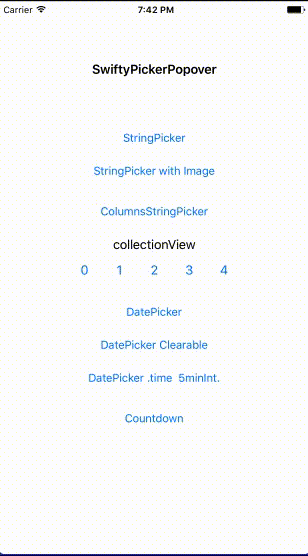
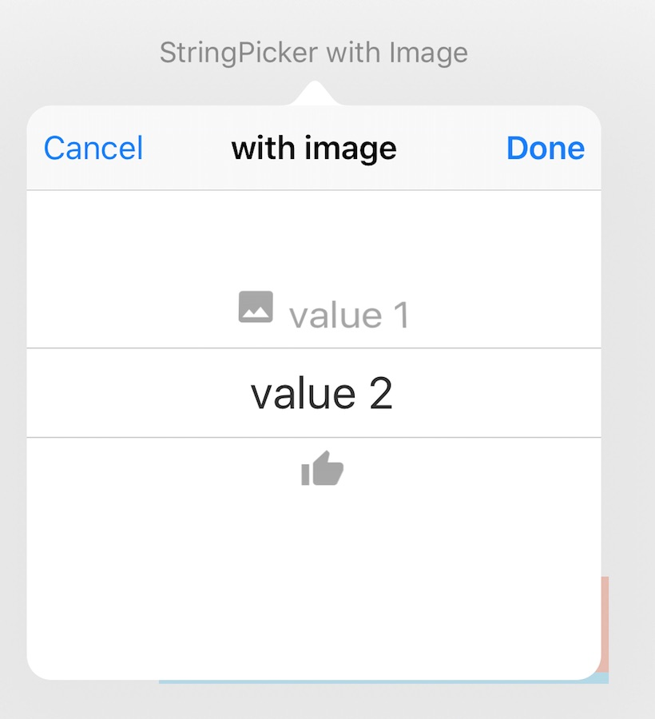

 # SwiftyPickerPopover
A more convenient way to display a popover with a built-in picker, on iPhone/iPad of iOS9+.

[](http://cocoadocs.org/docsets/SwiftyPickerPopover) 
[](http://cocoadocs.org/docsets/SwiftyPickerPopover)
[](http://cocoadocs.org/docsets/SwiftyPickerPopover)
[](https://github.com/hsylife/SwiftyPickerPopover)

## Features
- By simple code, you can display a popover that contains a built-in picker, on iPhone or iPad.
- Swift 4, iOS9+. UIPopoverController free. 
- Callback

## Screenshots


## Basic

```swift
DatePickerPopover(title: "DatePicker")
            .setDoneButton(action: { _, selectedDate in print(selectedDate)})
            .appear(originView: sender, baseViewController: self)
```

## Required
- Swift 4, Xcode 9.
- iOS 9+
- CocoaPods 1.1.0.rc.2+ or Carthage 0.12.0+

## License
MIT

## Install
### CocoaPods
Specify it in your 'Podfile', after replacing ‘YourProjectTargetName’ with your own target name:
```ruby
platform :ios, '9.0'
use_frameworks!
target ‘YourProjectTargetName’ do
pod 'SwiftyPickerPopover', :git => 'https://github.com/hsylife/SwiftyPickerPopover', :branch => 'swift4'
end
```
Run 'pod install'.

### Carthage
- Add it to your Cartfile:
```
github "hsylife/SwiftyPickerPopover" “swift4”
```
- Run `carthage update --platform iOS`
- Add 'SwiftyPickerPopover.framework' to 'Linked Frameworks and Library' on your project.
- Add `/usr/local/bin/carthage copy-frameworks` to 'New Run Script Phase'.
- Add `$(SRCROOT)/Carthage/Build/iOS/SwiftyPickerPopover.framework` to 'Input Files'.

### import
On your .swift file, import the module:
```swift
import SwiftyPickerPopover
```
### Popover types
SwiftyPickerPopover offers you the following popovers:
- **StringPickerPopover**: has an UIPickerView that allows user to choose a String type choice.
- **ColumnStringPickerPopover**: has an UIPickerView of multiple columns.
- **DatePickerPopover**: has an UIDatePicker that allows user to choose a Date type choice.
- **CountdownPickerPopover**: has an UIDatePicker specializing in countDownTimer style.

### APIs and examples
#### Common
All popovers have the following APIs.

* setPermittedArrowDirections()
* setArrowColor()
* setSize(width:,height:)

* appear(originView:, baseViewWhenOriginViewHasNoSuperview:, baseViewController:, completion:)
* appear(barButtonItem:, baseViewWhenOriginViewHasNoSuperview:, baseViewController:, completion:)
* disappear()
* disappearAutomatically(after seconds:, completion:)
* reload()

#### StringPickerPopover
* init(title:, choices:)

* setImageNames()
* setImages()
* setSelectedRow()
* setRowHeight()
* setDisplayStringFor()
* setDoneButton(title:, color:, action:)
* setCancelButton(title:, color:, action:)

##### You can use StringPickerPopover like this:
```swift
StringPickerPopover(title: "StringPicker", choices: ["value 1","value 2","value 3"])
        .setSelectedRow(0)
        .setDoneButton(action: { (popover, selectedRow, selectedString) in
            print("done row \(selectedRow) \(selectedString)")
        })
        .setCancelButton(action: { v in print("cancel")}
        )
        .appear(originView: button, baseViewController: self)
```

##### StringPickerPopover can have images. 



After adding image files to your target's Assets.xcassets:
```swift
StringPickerPopover(title: "StringPicker", choices: ["value 1","value2",""])
        .setImageNames(["Icon1",nil,"Icon3"])
        .appear(originView: button, baseViewController: self)
```

##### It can separate the screen values from the raw values:
```swift
let displayStringFor:((String?)->String?)? = { string in
   if let s = string {
      switch(s){
      case "value 1":
        return "😊"
      case "value 2":
         return "😏"
      case "value 3":
         return "😓"
      default:
         return s
      }
    }
  return nil
  }
        
let p = StringPickerPopover(title: "StringPicker", choices: ["value 1","value 2","value 3"])
            .setDisplayStringFor(displayStringFor)
            .setDoneButton(action: {
                popover, selectedRow, selectedString in
                print("done row \(selectedRow) \(selectedString)")
            })
            .setCancelButton(action: { v in
                print("cancel")
            })
            
        p.appear(originView: sender, baseViewController: self)
        p.disappearAutomatically(after: 3.0, completion: { print("automatically hidden")} )
```

##### To specify the size:
```swift
StringPickerPopover(title: "Narrow StringPicker", choices: ["value 1","value 2","value 3"])
            .setSize(width: 250.0)
            .appear(originView: sender, baseViewController: self)
```
The default width and height of popover are both 300.0.
By using setSize(width:, height:), you can override it or them.
When you set nil to the parameter or don't specify it, the default will be used.

##### It appears from the collectionView's cell:
```swift
func collectionView(_ collectionView: UICollectionView, didSelectItemAt indexPath: IndexPath) {
        
        let theCell = collectionView.dequeueReusableCell(withReuseIdentifier: "Cell", for: indexPath)
        
        let p = StringPickerPopover(title: "CollectionView", choices: ["value 1","value 2","value 3"])
                        .setSelectedRow(1)
                        .setDoneButton(title:"👌", action: { (popover, selectedRow, selectedString) in print("done row \(selectedRow) \(selectedString)") })
                        .setCancelButton(title:"🗑", action: { v in print("cancel")} )
        
        p.appear(originView: theCell, baseViewWhenOriginViewHasNoSuperview collectionView, baseViewController: self)
        
    }
```

If originView has no superView, then then you need to set baseViewWhenOriginViewHasNoSuperview as above to specify sourceView for the position for the arrow.
If it has the superview, then SwiftyPickerPopover automatically use it for the sourceView.

##### It appears from an UIBarButtonItem:
```swift
let item: UIBarButtonItem = sender
let originView = item.value(forKey: "view") as! UIView
p.appear(originView: originView, baseViewController: self)
```

#### ColumnStringPickerPopover
* init(title:, choices:, selectedRows:, columnPercents:)

* setSelectedRows()
* setFontSize()
* setDisplayStringFor()
* setDoneButton(title:, color:, action:)
* setCancelButton(title:, color:, action:)

##### ColumnStringPickerPopover can have multiple String values:
```swift
ColumnStringPickerPopover(title: "Columns Strings",
                                  choices: [["Breakfast", "Lunch", "Dinner"],["Tacos", "Sushi", "Steak", "Waffles", "Burgers"]],
                                  selectedRows: [0,0], columnPercents: [0.5, 0.5])
        .setDoneButton(action: { popover, selectedRows, selectedStrings in print("selected rows \(selectedRows) strings \(selectedStrings)")})
        .setCancelButton(action: {v in print("cancel")})
        .setFontSize(14)
        .appear(originView: sender, baseViewController: self)
)
```

#### DatePickerPopover
* init(title:)

* setSelectedDate()
* setDateMode()
* setMinimumDate()
* setMaximumDate()
* setMinuteInterval()
* setLocale()
* setDoneButton(title:, color:, action:)
* setCancelButton(title:, color:, action:)
* setClearButton(title:, color:, action:)

##### DatePickerPopover can be used like this:
```swift
DatePickerPopover(title: "DatePicker")
            .setDateMode(.date)
            .setSelectedDate(Date())
            .setDoneButton(action: { popover, selectedDate in print("selectedDate \(selectedDate)")})
            .setCancelButton(action: { v in print("cancel")})
            .appear(originView: sender, baseViewController: self)
```

##### The clear button rewinds the picker. And it disappers automatically after a specified seconds:
```swift
let p = DatePickerPopover(title: "Clearable DatePicker")
            .setDoneButton(action: { popover, selectedDate in print("selectedDate \(selectedDate)")} )
            .setCancelButton(action: { v in print("cancel")})
            .setClearButton(action: { popover, selectedDate in
                print("clear")
                //Rewind
                popover.setSelectedDate(Date()).reload()
            })
            
        p.appear(originView: sender, baseViewController: self)
        p.disappearAutomatically(after: 3.0)
```

##### The time interval is 5 mins. The arrow is permitted only to .down direction.:
```swift
DatePickerPopover(title: "DatePicker .time 5minInt.")
            .setDateMode(.time)
            .setMinuteInterval(5)
            .setPermittedArrowDirections(.down)
            .setDoneButton(action: { popover, selectedDate in print("selectedDate \(selectedDate)")} )
            .setCancelButton(action: { v in print("cancel")})
            .appear(originView: sender, baseViewController: self)
)
```

#### CountdownPickerPopover
* init(title:)

* setSelectedTimeInterval
* setDoneButton(title:, color:, action:)
* setCancelButton(title:, color:, action:)
* setClearButton(title:, color:, action:)

##### CountdownPickerPopover can be used like this:
```swift
 CountdownPickerPopover(title: "CountdownPicker")
            .setSelectedTimeInterval(TimeInterval())
            .setDoneButton(action: { popover, timeInterval in print("timeInterval \(timeInterval)")} )
            .setCancelButton(action: { v in print("cancel")})
            .setClearButton(action: { popover, timeInterval in print("Clear")
                popover.setSelectedTimeInterval(TimeInterval()).reload()
            })
            .appear(originView: sender, baseViewController: self)
```

## Customize
### How do I customize a popover's storyboard?
When you prepare your customized Storyboard, it will be applied automatically.

1. Find the original file of the popover's Storyboard, which you want to change. For example, 'CountdownPickerPopover.storyboard'.
2. Add it to your project on Xcode for including it into mainBundle. At this time, please check 'Copy items if needed'. Do not change the file name.
3. Next, change the module specified by default. Open the Storyboard file on Xcode and uncheck 'Inherit From Target' in InterfaceBuilder > Identity inspector > Custom Class. Specify 'SwiftyPickerPopover' for 'Module'.
4. Finally, customize your storyboard file.

## Contributors
- Ken Torimaru [GitHub](https://github.com/ktorimaru) for CountdownPickerPopover and ColumnStringPickerPopover.
- BalestraPatrick [GitHub](https://github.com/BalestraPatrick) for README.md typo.
- andersonlucasg3 [GitHub](https://github.com/andersonlucasg3) for adding possibility to override the storyboards with custom localizations in the app project.
- Mihael Isaev [GitHub](https://github.com/MihaelIsaev) for adding appear() from barButtonItem.

## Author
- Yuta Hoshino [Twitter](https://twitter.com/hsylife) [Facebook](https://www.facebook.com/yuta.hoshino)
