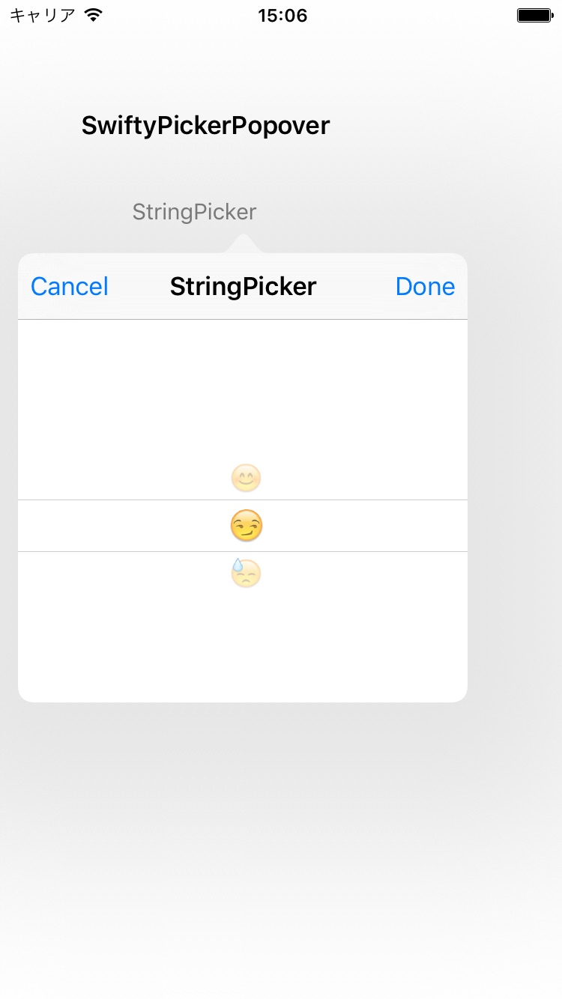

# SwiftyPickerPopover
Popover with Picker by Swift 3 for iPhone/iPad, iOS9+.

[](http://cocoadocs.org/docsets/SwiftyPickerPopover) 
[](http://cocoadocs.org/docsets/SwiftyPickerPopover) 
[](http://cocoadocs.org/docsets/SwiftyPickerPopover)
[](https://github.com/hsylife/SwiftyPickerPopover)

## Features
- Popover with Picker which can be chosen from several types, appears on iPhone or iPad.
- Swift 3, iOS9+. UIPopoverController free. 
- Callback

## Required
- Swift 3, Xcode 8. (If you want to use it on Swift 2.3, please check up SwiftyPickerPopover 1.1.0.)
- iOS 9+
- CocoaPods 1.1.0.rc.2+ or Carthage 0.12.0+

## License
MIT.

## Screenshots



## Usage
For Installing with CocoaPods, specify it in your 'Podfile'.
```ruby
platform :ios, '9.0'
use_frameworks!
pod 'SwiftyPickerPopover'
```
Run 'pod install'.

For Installing with Carthage, add it to your Cartfile.
```
github "hsylife/SwiftyPickerPopover"
```

On Xcode, import the module.
```swift
  import SwiftyPickerPopover
```
### Basic
DatePickerPopover appears.
```swift
  DatePickerPopover.appearFrom(originView: button, baseViewController: self, title: "DatePicker", dateMode: .Date, initialDate: NSDate(), doneAction: { selectedDate in print("selectedDate \(selectedDate)")}, cancelAction: {print("cancel")})
```

StringPickerPopover appears.
```swift
  StringPickerPopover.appearFrom(originView: button, baseViewController: self, title: "StringPicker", choices: ["value 1","value 2","value 3"], initialRow:0, doneAction: { selectedRow, selectedString in print("done row \(selectedRow) \(selectedString)")} , cancelAction: { print("cancel")})
```

ColumnStringPickerPopover which has variable multiple components, appers.
```swift
  ColumnStringPickerPopover.appearFrom(originView: button, baseViewController: self, title: "Columns Strings",
            choices: [["Breakfast", "Lunch", "Dinner"], ["Tacos", "Sushi", "Steak", "Waffles", "Burgers"]],
            initialRow: [0,0],
            columnPercent: [0.5, 0.5],
            fontSize: 12.0,
            doneAction: { selectedRows, selectedStrings in print("selected rows \(selectedRows) strings \(selectedStrings)")}, cancelAction: {print("cancel")})
```

CountdownPickerPopover which returns interval time, appears.
```swift
CountdownPickerPopover.appearFrom(originView: sender, baseViewController: self, title: "CountdownPicker", dateMode: .countDownTimer, initialInterval: TimeInterval(), doneAction: { timeInterval in print("timeInterval \(timeInterval)")}, cancelAction: {print("cancel")})
```

### Advanced
DatePickerPopover with clearAction 
```swift
  DatePickerPopover.appearFrom(originView: button, baseViewController: self, title: "Clearable DatePicker", dateMode: .Date, initialDate: NSDate(), doneAction: { selectedDate in print("selectedDate \(selectedDate)")}, cancelAction: {print("cancel")}, clearAction: { print("clear")})
```

StringPickerPopover with displayStringFor
```swift
let displayStringFor:((String?)->String?)? = { string in
   if let s = string {
      switch(s){
      case "value 1":
        return "😊"
      case "value 2":
         return "😏"
      case "value 3":
         return "😓"
      default:
         return s
      }
    }
  return nil
  }
        
  StringPickerPopover.appearFrom(originView: button, baseViewController: self, title: "StringPicker", choices: ["value 1","value 2","value 3"], displayStringFor: displayStringFor, initialRow:0, doneAction: { selectedRow, selectedString in print("done row \(selectedRow) \(selectedString)")} , cancelAction: { print("cancel")})
```
## Contributors
Ken Torimaru  [GitHub](https://github.com/ktorimaru) for CountdownPickerPopover and ColumnStringPickerPopover.

BalestraPatrick [GitHub](https://github.com/BalestraPatrick)
## Author
Yuta Hoshino [Twitter](https://twitter.com/hsylife) [Facebook](https://www.facebook.com/yuta.hoshino)
